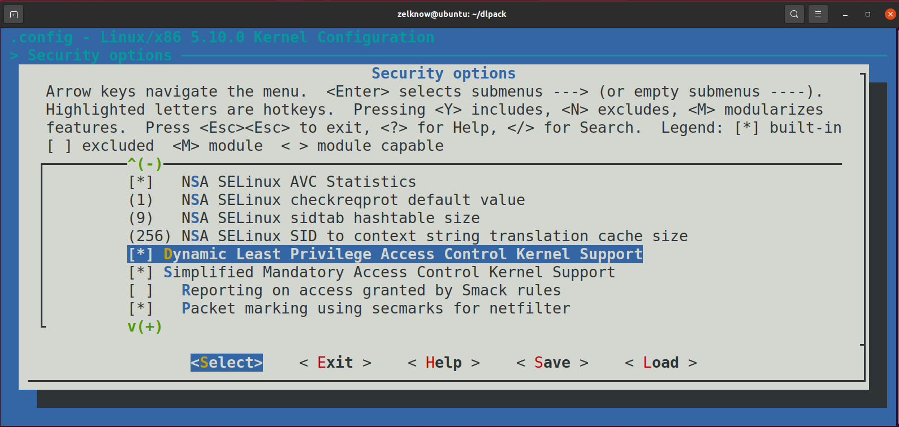

# DLPACK

## 编译运行

### 环境配置

- 安装必要服务
```
sudo apt-get update
sudo apt-get upgrade
sudo apt-get install zstd openssh-server libncurses5-dev bison flex libssl-dev libelf-dev git fakeroot build-essential ncurses-dev xz-utils libssl-dev
```

- 修改 `gcc` 版本
```
sudo apt-get install gcc-7
sudo update-alternatives --install /usr/bin/gcc gcc /usr/bin/gcc-7 100
sudo update-alternatives --install /usr/bin/gcc gcc /usr/bin/gcc-9 50
sudo update-alternatives --config gcc
```

### 内核编译
```
cp /boot/config-x.xx.x-xx-generic ./.config # 请将config-x.xx.x-xx-generic修改成当前内核的配置文件，或者选择/boot目录下的任一配置文件
make menuconfig
```

- 打开 security options


- 勾选此处


- 在此处添加 dlpack 安全模块


- 保存后退出
- 再打开 `.config` 文件，对下面两个字段进行修改：

```
CONFIG_SYSTEM_TRUSTED_KEYS=""
CONFIG_DEBUG_INFO_BTF=n
```

- 接下来就可以开始编译内核了：

```
make -j4
make modules_install # 这里编译过一次后可以去掉
make install
```

- 编译完成后，重启选择新编译的内核


## 源码结构

```
├── Kconfig
├── Makefile
├── include
│   ├── action.h // action相关头文件
│   ├── dl_policy.h // 策略相关头文件
│   ├── dlpack.h // 安全模块相关头文件
│   ├── event.h // 事件相关头文件
│   ├── pattern.h // syscall pattern 相关头文件
│   ├── right_abs.h // 权限抽象相关头文件
│   └── state.h // 状态相关头文件
├── README.md
├── action.c  // 实现状态转移时执行的action
├── dlpack.c // 安全模块主文件，包含钩函数实现和安全模块初始化函数
├── event.c // 实现事件
├── file_check.c // 实现文件相关的权限检查函数
├── fsm.c // 实现状态机相关函数
├── hash.c // 哈希函数
├── modules.order
├── pattern.c // 实现 syscall pattern 机制相关函数
├── policy_interface.c // 访问策略相关接口
├── right_abs.c // 权限抽象相关函数
├── securityfs.c // 安全模块的securityfs接口
├── state.c // 实现状态
└── trans.c // 实现状态转换
```

## 函数列表

- securityfs.c
```
/**
 * dlpack_write - event文件的write处理函数
 *
 * Return:
 *   >0: 成功写入的字节数
 *   <0: 写入失败
 */
static ssize_t dlpack_write(struct file *filep, const char __user *ubuf, size_t n, loff_t *l)
```
```
/**
 * dlpack_syscall_file_write - syscall pattern文件的write处理函数
 *
 * Return:
 *   >0: 成功写入的字节数
 *   <0: 写入失败
 */
static ssize_t dlpack_syscall_file_write(struct file *filep, const char __user *ubuf, size_t n, loff_t *l)
```
```
/**
 * dlpack_init_securityfs - securityfs 初始化函数
 *
 * Return:
 *   0: 初始化成功
 *   Others: 初始化失败
 */
static int __init dlpack_init_securityfs(void)
```
- action.c
```
/**
 * print_enter_state - 打印进入状态
 * @state: 状态名
 *
 * Return: 
 *   void
 */
static void print_enter_state(struct fsm_state *state)
```
```
/**
 * print_exit_state - 打印退出状态
 * @state: 状态名
 *
 * Return: 
 *   void
 */
static void print_exit_state(struct fsm_state *state)
```
```
/**
 * entry_print_state - 进入state时的action
 * @arg: action 参数
 *
 * Return: 
 *   void
 */
void entry_print_state(void *arg)
```
```
/**
 * exit_print_state - 退出state时的action
 * @arg: action 参数
 *
 * Return: 
 *   void
 */
void exit_print_state(void *arg)
```
- dlpack.c
```
/**
 * dlpack_task_alloc - 进程空间分配钩函数
 * @task: 进程 task_struct
 * @clone_flags: clone 标志
 *
 * Return:
 *   0: 成功
 *   Others: 失败
 */
static int dlpack_task_alloc(struct task_struct *task,
			     unsigned long clone_flags)
```
```
/**
 * dlpack_task_free - 进程释放钩函数
 * @task: 进程 task_struct
 *
 * Return:
 *   void
 */
static void dlpack_task_free(struct task_struct *task)
```
```
/**
 * dlpack_file_ioctl - ioctl 钩函数
 * @file: 文件
 * @cmd:
 * @arg:
 *
 * Return:
 *   void
 */
static int dlpack_file_ioctl(struct file *file, unsigned int cmd, unsigned long arg)
```
```
/**
 * dlpack_file_permission - file_permission 钩函数
 * @file: 文件
 * @mask: 权限 mask
 *
 * Return:
 *   0 
 */
static int dlpack_file_permission(struct file *file, int mask)
```
```
/**
 * set_init_ctx - 初始化进程安全上下文
 *
 * Return:
 *   0: 成功
 */
static int __init set_init_ctx(void)
```
```
/**
 * dlpack_init - dlpack 安全模块初始化函数
 *
 * Return:
 *   0: 成功
 */
static int __init dlpack_init(void)
```
- event.c
```
/**
 * add_event - 添加事件
 * @key: 事件名
 *
 * Return:
 *   0: 成功添加事件
 *   Others: 失败
 */
int add_event(char *key)
```
```
/**
 * get_event_id - 获得事件ID
 * @key: 事件名
 *
 * Return: 事件ID，负数表示不存在该事件
 */
int get_event_id(char *key)
```
```
/**
 *init_events - 初始化事件
 *
 * Return: 
 *   0: 未状态
 *   1: 成功初始化
 */
int init_events(void)
```
- fsm.c
```
/**
 * init_global_fsm - 初始化全局状态机
 *
 * Return:
 *   void
 */
void init_global_fsm(void)
```
```
/**
 * get_global_state - 获取全局状态
 *
 * Return:
 *   state: 全局状态
 */
struct fsm_state *get_global_state(void)
```
```
/**
 * find_trans_item - 对输入的event寻找符合的状态转换表项
 * @state: 状态
 * @event: 事件ID
 *
 * Return: 目标表项，若找不到则返回NULL
 */
struct fsm_trans_list *find_trans_item(struct fsm_state *state, int event)
```
```
/**
 * fsm_run - 对输入的event进行一次状态转换
 * @fsm: 状态机
 * @evt_id: 事件ID
 *
 * Return:
 *   0: 成功转换到下个状态
 *   1: 转换到下个状态失败（未通过guard）
 *   2: FSM failure, 例如无法找到满足条件的表项
 */
int fsm_run(struct fsm *fsm, int event)
```
- pattern.c
```
/**
 * task_init - 初始化进程syscall pattern机制
 * @ctx: 进程安全上下文
 *
 * Return:
 *   0: 成功初始化
 *   Others: 失败
 */
int task_init(struct task_ctx *ctx)
```
```
/**
 * copy_task_waiting - 复制初始化
 * @new_ctx: 子进程安全上下文
 * @old_ctx: 父进程安全上下文
 *
 * Return:
 *   0: 成功初始化
 *   Others: 失败
 */
int copy_task_waiting(struct task_ctx *new_ctx, struct task_ctx *old_ctx)
```
```
/**
 * task_free - 释放进程的syscall pattern相关资源
 * @ctx: 进程安全上下文
 *
 * Return:
 *   void
 */
void task_free(struct task_ctx *ctx)
```
```
/**
 * process_syscall - 处理进程的执行的syscall
 * @ctx: 进程安全上下文
 * @event: syscall对应的事件名
 *
 * Return:
 *   0: 成功处理
 *   Others: 失败
 */
int process_syscall(struct task_ctx *ctx, char *event)
```
- state.c
```
/**
 * add_state - 添加状态
 * @id: 状态号
 *
 * Return: 
 *   0: 成功添加状态
 *   Others: 失败
 */
int add_state(int id)
```
```
/**
 * add_trie_node - 添加字典树节点
 * @id: 状态号
 *
 * Return: 
 *   0: 成功添加状态
 *   Others: 失败
 */
int add_trie_node(int id)
```
```
/**
 * get_state - 获得状态
 * @param id: 状态号
 *
 * Return: 状态指针
 */
struct fsm_state *get_state(int id)
```
```
/**
 * get_trie_node - 获得字典树的节点
 * @param id: 状态号
 *
 * Return: 状态指针
 */
struct fsm_state *get_trie_node(int id)
```
```
/**
 * reset_states - 重置所有状态
 *
 * Return: void
 */
void reset_states(void)
```
```
/**
 * init_states - 初始化状态
 *
 * Return:
 *   0: 成功初始化
 *   Others: 初始化失败
 */
int init_states(void)
```
```
/**
 * init_trie - 初始化字典树
 *
 * Return:
 *   0: 成功初始化
 *   Others: 初始化失败
 */
int init_trie(void)
```
```
/**
 * print_all_state - 展示所有state
 *
 * Return: void
 */
void print_all_state(void)
```
- trans.c
```
/**
 * add_trans - 添加状态转换规则
 * @ori: 原状态
 * @target: 目标状态
 * @event: 触发事件
 *
 * Return: 
 *   0: 成功添加状态转换规则
 *   Others: 失败
 */
int add_trans(struct fsm_state *ori_p, struct fsm_state *target_p, int event_id)
```
```
/**
 * trans_del - 删除state的所有转换规则
 * @state: 原状态
 *
 * Return: void
 */
void trans_del(struct fsm_state *state)
```
